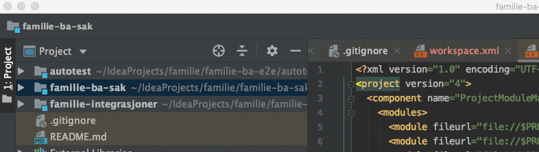
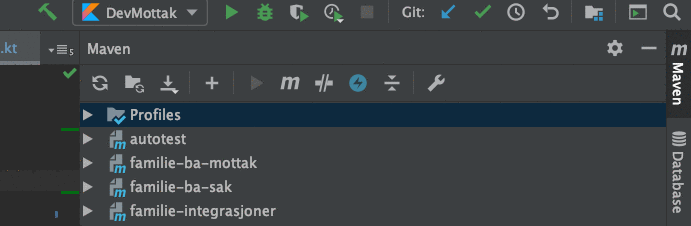

## IntelliJ konfigurasjon for lokal e2e testing/debugging

I runConfigurations-mappa ligger det maler for ba-mottak, ba-sak og familie-integrasjoner,
samt konfigurasjoner klare til bruk for [navkafka-docker-compose][1] og parallell oppstart av alle Maven-applikasjonene
i e2e-riggen.

Det som gjenstår i konfigurasjonen for de førstnevnte er å bytte ut alle placeholder-verdier
for CLIENT_ID, CLIENT_SECRET osv., med de som ligger i Vault. (Spring-profilen de kjører er heller ikke spikret, og baserer seg "dev"-profilene p.t)

I tillegg må alle Maven-prosjektene det er laget run-konfigurasjon for importeres som moduler (sak, mottak, integrasjoner og evt. autotest')

File -> Project Structure... -> Modules -> Add (+) -> Import Module -> pom.xml -> Open

Next -> Next -> Finish

(Det er forøvrig noe som kan anbefales generelt, fremfor å jobbe isolert med hvert enkelt prosjekt i et eget vindu)

Etter det burde det fungere å kjøre run-konfigurasjonene fra IntelliJ.
Start først navkafka i vanlig run-modus, og deretter ba-e2e i run eller debug-mode

[1]: https://github.com/navikt/navkafka-docker-compose
